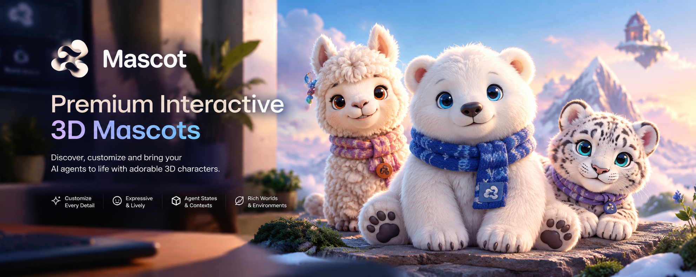

<p align="center">
  
</p>

# Mascot — Living Characters for Intelligent Work

Mascot is a platform of **real-time 3D characters** that can become the visual identity of an AI agent, a product or a tool. They breathe, blink, look back at you, wear and carry things, change mood with what an agent is doing, and live in rendered worlds. Nothing on the site is a flat image of a mascot: the hero, the playground and the collection previews are all drawn live by the same renderer.

> **Status: working prototype.** The rendering engine, character system, agent states, worlds, playground and landing page are implemented and verified in headless Chrome with software GL. The four characters are **procedural prototype designs**, not final art — the pipeline is built so professionally modelled GLBs can replace them. See [Development status](#development-status) for what is and isn't done.

## Why it exists

Agent products have faces made of logos and sparkles. Characters carry trust and state far better — if they feel physically present. The bar here is "premium character studio", not "avatar generator": dimensional fur, readable faces, motion that never fully stops, light you can change, and objects that are actually attached.

## What's in it

| | |
|---|---|
| **Characters** | Floe (polar bear cub, short plush coat), Alma (baby alpaca, clumped wool + topknot), Lumi (snow leopard cub, directional coat with painted rosettes, whiskers, long tail), Orbit (synthetic non-animal). Each is its own body, face and fur personality — not a recoloured model. |
| **Fur & materials** | Hybrid shell fur (one instanced draw per part, procedural strands, clumping, root shadow, backscatter rim), per-character fur profiles, 14 surfaces from fur/wool/fleece/velvet to rubber, glossy, metallic, translucent. Fur length, density, softness, fluffiness, direction, variation, roughness and sheen are live sliders. |
| **Face** | 14 expressions with smooth transitions; sliders for eye size, iris, pupil, spacing, highlight, squint, blink speed; heterochromia; eyes follow the cursor (eyes first, head second). |
| **Colour** | Region-based (coat, markings, eyes, blush, inner ears, paws, outfit pieces) with a curated palette grid, HSV sliders, HEX and RGB entry. |
| **Outfit & charms** | Scarf, bow tie, glasses, headphones, cap, backpack, badge, watch — attached to named body points with spring-chain secondary motion. A six-slot keychain rail with ~40 original miniatures (keyboard, terminal, commit graph, database, rocket, energy hammer, arc-reactor-style badge…). |
| **Agent states** | 29 states (coding, reading, searching, deploying, blocked, successful…). A state sets expression, working posture, props placed on a table or in hand, and a small status halo above the head. |
| **Movement** | Walk/run/hop/float/circle loops; walk-in, run-in, fly-in, drop-in, peek-in, jump-in, approach, float-in and teleport entrances/exits; a movement builder (direction, duration, delay, easing, gait). |
| **Worlds & light** | 10 real-time worlds (mountain, forest, fantasy islands, beach, flight, studio, developer desk, rainy city, office, space) × 11 lighting presets, 11 camera presets. |
| **Landing page** | One fixed live canvas; scrolling travels through fog-and-cloud veils between worlds and characters. |
| **Resilience** | Quality changes are transactions with a fallback ladder (ultra → high → medium → low → safe mode); WebGL context loss is recovered; the character is never removed because of a settings change. |

## Run it

```bash
npm install
npm run dev          # http://localhost:5173
npm run build        # typecheck + production build
npm run thumbs       # re-render public/thumbs/*.webp from the live renderer (headless Chrome)
```

`?quality=low|medium|high|ultra` overrides device detection. Routes are hash-based and static-host friendly: `#/` · `#/explore` · `#/mascot/:id` (`?c=` carries a shared look; add `?debug` to expose `window.__stage` for QA).

## Documents

- [`RESEARCH.md`](RESEARCH.md) — what was studied, what was decided, what is still an assumption.
- [`ARCHITECTURE.md`](ARCHITECTURE.md) — modules, render lifecycle, quality/fallback system, character, accessory and world systems.
- [`MASCOT_QUALITY_CHECKLIST.md`](MASCOT_QUALITY_CHECKLIST.md) — the visual QA loop and the results of the last pass.
- [`ASSETS.md`](ASSETS.md) — licence and provenance for everything shipped.

## Adding a character

1. Copy `src/mascot/definitions/floe.ts`; define parts, palette, fur profile, face, attach points, signature look.
2. Register it in `src/mascot/registry.ts` and add its thumbnail job in `scripts/render-thumbnails.mjs`.
3. `npm run thumbs`.

Accessories, charms, props, states, worlds and lighting need no changes — they bind to attach points and roles.

## Development status

**Done and verified (headless, software GL, low tier):** all routes render; quality changes at runtime; forced GL failure falls back without losing the character; context loss/restore; mobile and reduced-motion layouts; route churn (dispose paths). Results: [`MASCOT_QUALITY_CHECKLIST.md`](MASCOT_QUALITY_CHECKLIST.md).

**Not done / honest gaps**
- **No real-GPU measurements.** Tier thresholds are estimates; adaptive downgrade is the safety net. First task on hardware: profile phones and integrated GPUs.
- **Characters are procedural prototypes**, built from primitives. A modeller/rigger is needed for final quality; the GLB loader branch exists in the data model but is not implemented.
- **`mascot-hero-background.png` was not supplied.** The hero environment was recreated from the README banner's composition (pastel peaks, floating castle island, mossy ledge, blurred desk) instead.
- WebGPU is evaluated, not used (see RESEARCH.md). Cloth is a spring-chain approximation, not a simulation. Airport/lab/hangar worlds and large vehicles beyond the aeroplane wing and rocket are not built.
- No payments, accounts or backend by design.

## Brand

The Mascot mark (`public/brand/`) is an original three-bean trefoil — many characters, one system — refined from the supplied reference and checked down to 16 px. The generated reference images in `docs/brand/` are art direction only and are not shipped as site content.
